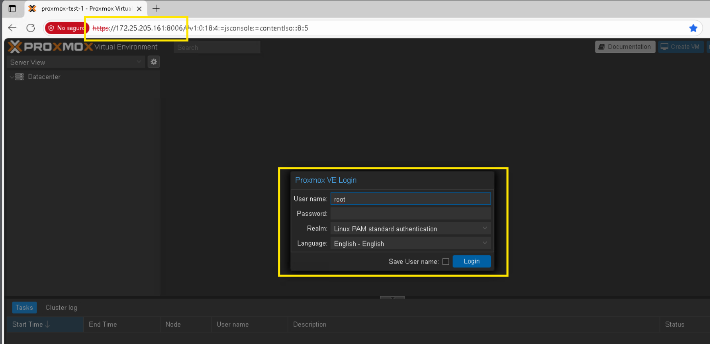
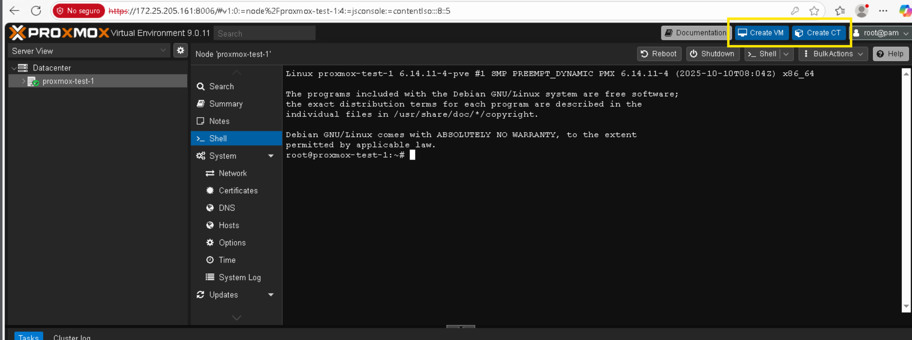

# Guía básica de virtualización con Proxmox VE

## 1. Acceso a la interfaz web de Proxmox VE

Usaremos la **interfaz web** de Proxmox VE desde un navegador (Chrome, Edge, Firefox). 

### 1.1. IP y puerto de Proxmox

El administrador te entregará:
- **IP del servidor Proxmox** (ej.: `172.25.205.161`)
- **Puerto de administración** (**por defecto `8006`**)

Luego, abre el navegador y accede con:

```text
https://IP_DEL_PROXMOX:8006
```



## 2. Preparar imágenes para las máquinas virtuales y contenedores

Antes de crear una VM o un contenedor LXC, Proxmox necesita tener:

- **Imágenes ISO** de sistemas operativos (para las VMs).
- **Plantillas de contenedor (CT Templates)** para los LXC.

### Paso 2.1: Cargar imágenes ISO para las VM

En el panel izquierdo selecciona el almacenamiento del nodo, por ejemplo:

- `local (proxmox-test-1)`

Luego, en la parte central, abre la pestaña **ISO Images**. Arriba verás dos botones principales:

- **Upload**  
  Permite **subir un archivo `.iso` desde tu computadora** al almacenamiento `local`.  
  Úsalo cuando ya descargaste la ISO (por ejemplo, `ubuntu-22.04.iso`) en tu PC y quieres tenerla disponible en Proxmox.

- **Download from URL**  
  Permite **descargar una ISO directamente desde una URL**.  
  Es útil si el servidor Proxmox tiene acceso a internet y quieres bajar la ISO desde el sitio oficial sin pasar por tu PC.


Todas las ISOs que cargues aquí aparecerán en la lista y luego podrás seleccionarlas al usar el asistente **Create VM**.

### Paso 2.2: Descargar o subir CT Templates (contenedores LXC)

En el mismo almacenamiento `local (proxmox-test-1)`, selecciona ahora la pestaña **CT Templates**. Aquí gestionas las **plantillas que se usan para crear contenedores LXC**.

En la parte superior verás:

- **Templates**  
  Abre un catálogo de plantillas oficiales (Debian, Ubuntu, Alpine, etc.) de los repositorios de Proxmox.  
  Desde aquí puedes elegir una distribución y descargarla con un clic.

- **Upload**  
  Permite **subir una plantilla de contenedor** (`.tar.xz`, `.tar.zst`) que ya tengas descargada en tu PC.

- **Download from URL**  
  Permite **descargar una plantilla desde una URL directa**, similar a las ISO.


Una vez que tengas al menos una plantilla descargada, podrás seleccionarla cuando uses el asistente **Create CT** para crear contenedores LXC ligeros.

## 4. Crear máquinas virtuales (VM) y contenedores (CT) desde la interfaz

Proxmox VE permite dos tipos principales de entornos en el nodo:

- **Máquinas virtuales (VM)**: sistemas completos (Linux, Windows, etc.) con su propio hardware virtual (CPU, RAM, disco).
- **Contenedores LXC (CT)**: sistemas Linux ligeros que comparten el kernel del host y consumen menos recursos.

> 💡 Antes de empezar, selecciona tu nodo (por ejemplo, `proxmox-test-1`) en el panel izquierdo.



Con el nodo seleccionado, en la parte superior derecha verás dos botones:

- **Create VM**  
  Abre el asistente para crear una VM a partir de una imagen ISO. En los siguientes pasos elegirás ISO, tamaño de disco, CPU, RAM y red.

- **Create CT**  
  Abre el asistente para crear un contenedor LXC usando una plantilla de CT (de la sección **CT Templates**). También configurarás nombre, disco, CPU, RAM y red.

En las siguientes secciones de la guía se explicará paso a paso cómo:

1. Crear la **primera VM** con **Create VM**.  
2. Crear el **primer contenedor LXC** con **Create CT**.  
3. Más adelante, ver una alternativa usando **scripts desde la pestaña Shell** del nodo.
